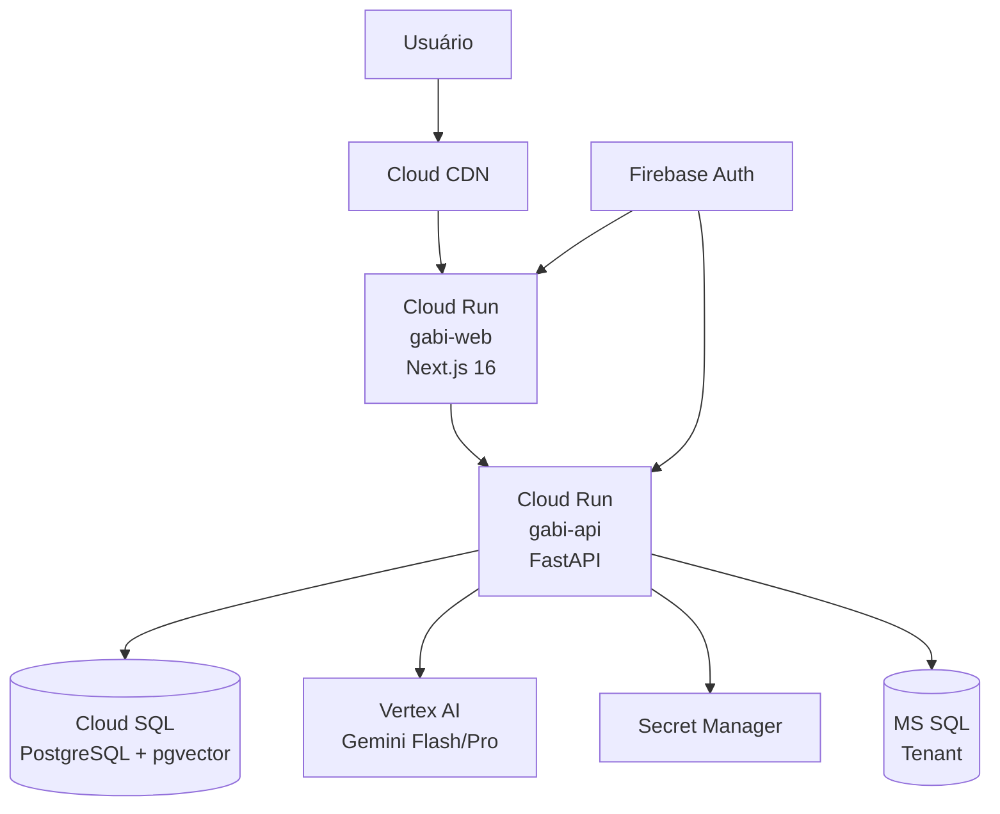

# PLAN: Construir todas as gabis e colocar no ar

> **Slug:** `build-deploy` · **Scope:** Full-stack build + GCP deploy · **Estimated:** ~3h dev

---

## Inventário Atual (Auditado)

### ✅ Já existe e funciona (scaffolded)

| Camada | Artefato | Status |
|--------|----------|--------|
| **Backend** | 4 routers completos (ghost 182L, law 145L, ntalk 215L, insightcare 230L) | ✅ Lógica real |
| **Backend** | 5 models SQLAlchemy (ghost, law, ntalk, insightcare, user) | ✅ Tabelas definidas |
| **Backend** | `core/ai.py` — Vertex AI + model routing | ✅ |
| **Backend** | `core/auth.py` — Firebase Admin verify | ✅ |
| **Backend** | `core/embeddings.py` — bge-m3 local | ✅ |
| **Backend** | `core/memory.py` — chat summarization | ✅ |
| **Backend** | `config.py` + `database.py` — async PG | ✅ |
| **Frontend** | 4 module pages + dashboard + sidebar + chat-panel | ✅ Design System |
| **Frontend** | `auth-provider.tsx` — Firebase onAuthStateChanged | ✅ |
| **Frontend** | `package.json` — Next.js 16, React 19, Tailwind v4 | ✅ |
| **Backend** | `pyproject.toml` — todas as deps declaradas | ✅ |

### ❌ Falta construir

| # | Artefato | Impacto |
|---|----------|---------|
| 1 | `web/src/lib/firebase.ts` — Firebase Client SDK config | Auth client não funciona |
| 2 | `web/src/lib/api.ts` — Axios client com interceptor | Chamadas API não funcionam |
| 3 | Login page (`/login`) + route guard | Sem autenticação visual |
| 4 | Upload endpoints (ghost docs, law docs, insightcare docs) | Sem ingestão de documentos |
| 5 | Alembic init + migration inicial | Banco não cria tabelas |
| 6 | `api/Dockerfile` | Não deploya backend |
| 7 | `web/Dockerfile` | Não deploya frontend |
| 8 | `cloudbuild.yaml` (CI/CD) | Sem deploy automático |
| 9 | `.env.example` atualizado + Secret Manager setup | Config incompleta |
| 10 | `npm install` no web/ | TS types não existem |

---

## Fases de Execução

### Fase 1: Fundação (Prioridade Máxima)

> **Objetivo:** Backend + Frontend compilam e rodam localmente

#### 1.1 Frontend Bootstrap
- [ ] `cd web && npm install`
- [ ] Criar `src/lib/firebase.ts` (initializeApp, auth, onAuthStateChanged)
- [ ] Criar `src/lib/api.ts` (axios client com Bearer token interceptor, métodos por módulo)
- [ ] Criar `src/app/login/page.tsx` (UI com design system gabi.)
- [ ] Adicionar route guard em `layout.tsx` (redireciona p/ /login se !user)

#### 1.2 Backend Bootstrap
- [ ] `cd api && pip install -e ".[dev]"`
- [ ] Criar `.env` com valores reais (PG, Firebase, GCP)
- [ ] Alembic init: `alembic init alembic/`
- [ ] Configurar `alembic/env.py` (async, import all models)
- [ ] Gerar migration inicial: `alembic revision --autogenerate -m "initial"`
- [ ] Aplicar: `alembic upgrade head`

#### 1.3 Verificação Local
- [ ] `uvicorn app.main:app --reload` → `/health` retorna OK
- [ ] `npm run dev` → Dashboard renderiza com sidebar
- [ ] Login funciona via Firebase
- [ ] Chat de qualquer módulo envia e recebe resposta

---

### Fase 2: Upload & Ingestão de Documentos

> **Objetivo:** Cada módulo recebe documentos e indexa com RAG

#### 2.1 gabi.writer (Ghost)
- [ ] POST `/api/ghost/upload` — recebe arquivos de estilo + conteúdo
- [ ] Processamento: extract text → chunk → embed → save
- [ ] UI: botão Upload no header do módulo

#### 2.2 gabi.legal (Law)
- [ ] POST `/api/law/upload` — recebe leis, contratos, peças
- [ ] Processamento: PDF→text (PyMuPDF) → chunk com hierarquia → embed
- [ ] UI: botão Upload

#### 2.3 gabi.data (nTalk)
- [ ] POST `/api/ntalk/connections` — registra conexão MS SQL do tenant
- [ ] POST `/api/ntalk/schema-sync` — sincroniza schema → Business Dictionary
- [ ] UI: settings panel para conexão

#### 2.4 gabi.care (InsightCare)
- [ ] POST `/api/insightcare/upload` — recebe apólices, claims XLSX, normas PDF
- [ ] Processamento XLSX: pandas → ClaimsData
- [ ] Processamento PDF: PyMuPDF → chunk → embed
- [ ] UI: botão Upload

---

### Fase 3: Deploy GCP

> **Objetivo:** `api.gabi.ai` + `app.gabi.ai` rodando em Cloud Run

#### 3.1 Containerization
- [ ] `api/Dockerfile` (Python 3.11-slim, multi-stage, uvicorn)
- [ ] `web/Dockerfile` (Node 20-alpine, next build, next start)
- [ ] `.dockerignore` para ambos

#### 3.2 GCP Setup
- [ ] Cloud SQL for PostgreSQL + pgvector extension
- [ ] Secret Manager: DB_URL, FIREBASE_SA, secrets do .env
- [ ] Artifact Registry: `gabi-api`, `gabi-web`
- [ ] Service Account com roles: aiplatform.user, secretmanager.accessor, cloudsql.client

#### 3.3 Cloud Build CI/CD
- [ ] `cloudbuild.yaml` — triggers no push branch main
- [ ] Build + push imagens → Artifact Registry
- [ ] Deploy → Cloud Run (api: 1GB RAM, web: 512MB)
- [ ] Env vars via Secret Manager refs

#### 3.4 Firebase Setup
- [ ] Firebase project (ou reuse existente)
- [ ] Auth: Google provider + Email/Password
- [ ] Authorized domains: gabi.ai, localhost
- [ ] Admin SDK service account → Secret Manager

#### 3.5 DNS & Domínio
- [ ] Cloud Run domain mapping: `api.gabi.ai`, `app.gabi.ai`
- [ ] Cloud CDN (opcional) no frontend
- [ ] CORS config atualizado com domínios prod

---

### Fase 4: Polimento para Produção

> **Objetivo:** UX production-ready

- [ ] Streaming responses (SSE) nos endpoints de chat
- [ ] Loading states com skeleton no frontend
- [ ] Error boundaries + toast notifications (Sonner)
- [ ] Admin page: gestão de usuários e roles
- [ ] Rate limiting nos endpoints de AI
- [ ] Health check detalhado (DB, Vertex, Firebase)

---

## Stack Final

## Ordem de Execução Recomendada

| Sprint | Fases | Tempo | Entrega |
|--------|-------|-------|---------|
| **Sprint 1** | 1.1 + 1.2 + 1.3 | ~1h | Roda local, chat funciona |
| **Sprint 2** | 2.1 + 2.2 + 2.3 + 2.4 | ~1h | Upload + RAG funcional |
| **Sprint 3** | 3.1 → 3.5 | ~1h | Produção live |
| **Sprint 4** | 4.x | Iterativo | Polimento |

---

## Decisões Abertas (perguntar ao usuário)

1. **Domínio**: Já tem `gabi.ai` ou usar outro? (ex: `gabi.ness.com.br`)
2. **Firebase**: Projeto novo ou reuse do existente (ness/nghost)?
3. **Cloud SQL**: Tier — db-f1-micro (free tier) ou db-custom-1-3840?
4. **Sprint 1 primeiro?** Ou quer que eu comece do deploy (Sprint 3)?
