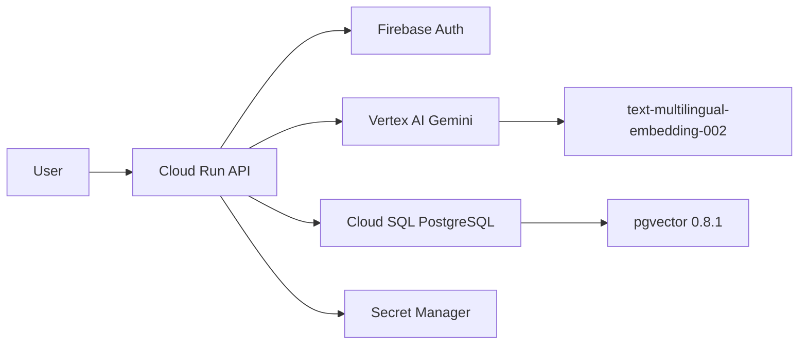

# 🧠 Brainstorm: Programa de Implementação SDLC + SSDLC — Gabi Platform

## Context

A Gabi é uma plataforma AI enterprise com 2 módulos verticais (Legal + Style), servindo setores regulados (jurídico, financeiro, seguros). O repositório já tem CI/CD (Cloud Build), 199 testes, monitoramento, e compliance LGPD. O programa SDLC/SSDLC está **ativo** com 10 scanners de segurança automatizados.

---

## Programa de Implementação SDLC/SSDLC

### Fase 1: Planejamento e Requisitos (PLAN)

#### 1.1 Governança
| Artefato | Status | Ação |
|----------|--------|------|
| Risk Register | ❌ | Criar `docs/risk-register.md` com riscos operacionais, de compliance e técnicos |
| Threat Model (STRIDE) | ❌ | Criar por módulo: attack surfaces, trust boundaries, data flows |
| Security Requirements | ⚠️ | Formalizar: LGPD (existente), OWASP Top 10, CIS Benchmarks |
| Definition of Done | ❌ | Incluir: code review, tests, SAST, DAST, changelog entry |
| Data Classification | ❌ | PII mapping: chat_messages, user records, legal docs, insurance data |

#### 1.2 Requisitos de Segurança por Módulo
```
gabi.legal  → Confidencialidade de documentos jurídicos, sigilo profissional
gabi.writer → Propriedade intelectual de textos, style profiles
gabi.data   → Prevent SQL injection (já com allowlist), credential vault
```

#### 1.3 Compliance Matrix
| Framework | Aplicável | Status |
|-----------|-----------|--------|
| LGPD (Lei 13.709) | ✅ | Parcial — export/purge/consent ✅, DPO designation ❌ |
| OWASP API Top 10 | ✅ | Parcial — rate limiting ✅, BOLA checks ❌ |
| CIS GCP Benchmark | ✅ | Parcial — Secret Manager ✅, VPC ❌ |
| SOC 2 Type II | 🎯 | Futuro — logging ✅, access control ✅, change mgmt ❌ |

---

### Fase 2: Design e Arquitetura (DESIGN)

#### 2.1 Secure Architecture Review
| Componente | Análise | Risco |
|------------|---------|-------|
| Auth (Firebase) | Token verification ✅ | Médio — sem refresh token rotation |
| Database (Cloud SQL) | Private IP ✅, authorized networks cleaned ✅ | Baixo |
| AI (Vertex AI) | Anti-hallucination guardrail ✅ | Médio — prompt injection possível |
| File Upload | Size + type validation needed | Alto — arbitrary file upload |
| Secrets | Secret Manager ✅ | Médio — rotation reminder only, no auto-rotate |

#### 2.2 Architecture Decision Records (ADRs)
| ADR | Decisão |
|-----|---------|
| ADR-001 | Vertex AI embeddings vs local (chose Vertex — reduced image 2GB→400MB) |
| ADR-002 | Dynamic RAG vs always-retrieve (chose Dynamic — saves ~200ms) |
| ADR-003 | Multi-agent debate vs single agent (chose multi — better accuracy for legal) |
| ADR-004 | asyncpg vs psycopg2 (chose asyncpg — async throughout) |
| ADR-005 | Cloud Run vs GKE (chose Cloud Run — simpler ops, auto-scaling) |

#### 2.3 Data Flow Diagrams


---

### Fase 3: Implementação (BUILD)

#### 3.1 Coding Standards
| Area | Standard | Enforcement |
|------|----------|-------------|
| Python | PEP 8 + type hints | `ruff` linter in CI |
| SQL | Parameterized queries only | ALLOWED_TABLE_PAIRS allowlist |
| Secrets | Never in code | `pre-commit-hooks` (gitleaks) |
| Dependencies | Pinned versions | `pyproject.toml` + `poetry.lock` |
| Branching | GitFlow (main→staging→prod) | Branch protection rules |

#### 3.2 Secure Coding Practices
| Practice | Implementado | Ação |
|----------|-------------|------|
| Input validation (Pydantic) | ✅ | 20+ response models criados |
| Output encoding | ⚠️ | Adicionar HTML escaping em respostas |
| Error handling (no stack traces) | ✅ | ErrorHandler middleware |
| Anti-hallucination | ✅ | System prompt guardrail |
| SQL injection prevention | ✅ | ALLOWED_TABLE_PAIRS + parameterized |
| Rate limiting | ✅ | Per-user in-memory + Redis fallback |
| CORS | ⚠️ | Verificar configuração atual |

#### 3.3 Pre-commit Hooks
```yaml
# .pre-commit-config.yaml (A CRIAR)
repos:
  - repo: https://github.com/astral-sh/ruff-pre-commit
    hooks: [ruff, ruff-format]
  - repo: https://github.com/gitleaks/gitleaks
    hooks: [gitleaks]
  - repo: https://github.com/pre-commit/pre-commit-hooks
    hooks: [check-yaml, check-json, detect-private-key, end-of-file-fixer]
  - repo: https://github.com/PyCQA/bandit
    hooks: [bandit]
```

---

### Fase 4: Testing (TEST)

#### 4.1 Test Pyramid
| Nível | Atual | Meta | Ferramentas |
|-------|-------|------|-------------|
| Unit | 9 files, ~70 tests | 80%+ coverage | pytest, unittest.mock |
| Integration | 6 files, ~47 tests | All routers covered | pytest + TestClient |
| E2E | ❌ | Happy paths + error paths | playwright / httpx |
| Load | ✅ k6 (3 scenarios) | Add soak + spike tests | k6 |
| Security | ❌ | OWASP ZAP + bandit | ZAP, bandit, safety |

#### 4.2 Security Testing
| Tipo | Ferramenta | Status | Frequência |
|------|-----------|--------|------------|
| SAST | `bandit` (Python) | ✅ CI | Cada push |
| SAST | `semgrep` (multi-lang) | ✅ CI | Cada push |
| SCA | `pip-audit` | ✅ CI | Cada push |
| DAST | OWASP ZAP baseline | ✅ CI (staging) | Cada deploy staging |
| Secrets Scan | `gitleaks` | ✅ CI + pre-commit | Cada push |
| Container Scan | `trivy` (API + Web) | ✅ CI | Cada build |
| IaC Scan | `checkov` (Dockerfiles) | ✅ CI | Cada push |
| Code Quality | `ruff` | ✅ CI | Cada push |
| Coverage | `pytest --cov` | ✅ CI | Cada push |

#### 4.3 CI Security Pipeline (Implementado)
```yaml
# cloudbuild-staging.yaml — 10 security steps
- test-api:     pytest --cov (199 testes + coverage)
- sast-bandit:  Bandit Python SAST
- sca-audit:    pip-audit dependency scan
- secrets-scan: Gitleaks credential detection
- iac-checkov:  Checkov Dockerfile audit
- sast-semgrep: Semgrep multi-language SAST
- lint-ruff:    Ruff code quality (700+ rules)
- trivy-api:    Trivy container scan (API image)
- trivy-web:    Trivy container scan (Web image)
- dast-zap:     OWASP ZAP baseline (post-deploy)
```

---

### Fase 5: Deployment (DEPLOY)

#### 5.1 Pipeline Atual
```
push main → gabi-staging-deploy → cloudbuild-staging.yaml → gabi-api-staging
tag v*    → gabi-prod-deploy    → cloudbuild-prod.yaml    → gabi-api (prod)
```

#### 5.2 Melhorias SSDLC
| Melhoria | Status | Prioridade |
|----------|--------|------------|
| Staging auto-deploy ✅ | Implementado | — |
| Prod tag-based deploy ✅ | Implementado | — |
| SBOM generation (Syft) | ❌ | Alta |
| Image signing (cosign) | ❌ | Alta |
| Deployment approval gate | ❌ | Média |
| Canary deployment | ❌ | Média |
| Rollback automation | ⚠️ | Documentado em runbooks |
| Infrastructure as Code | ⚠️ | Cloud Build YAML parcial, falta Terraform |

#### 5.3 Environment Matrix
| Env | URL | Trigger | Gates |
|-----|-----|---------|-------|
| Dev | local | manual | tests pass |
| Staging | `gabi-api-staging-*.run.app` | push to main | tests + SAST |
| Prod | `gabi-api-*.run.app` | tag v* | tests + SAST + approval |

---

### Fase 6: Operações e Monitoramento (OPERATE)

#### 6.1 Observability Stack
| Pilar | Implementado | Ferramenta |
|-------|-------------|-----------|
| Metrics | ✅ | Cloud Monitoring (5xx errors, high latency) |
| Logs | ✅ | Cloud Logging (structured JSON) |
| Traces | ❌ | Cloud Trace (OpenTelemetry) |
| Uptime | ✅ | Uptime check `/health` 5min |
| Alerting | ✅ | Email notification 5xx rate |
| Dashboard | ❌ | Cloud Monitoring custom dashboard |
| APM | ❌ | Cloud Profiler |

#### 6.2 SLOs/SLIs
| SLI | Meta SLO | Atual |
|-----|----------|-------|
| Availability (uptime) | 99.9% | monitorado ✅ |
| Latency p95 | < 2s | alerta >5s ✅ |
| Error rate | < 0.1% | alerta 5xx ✅ |
| AI response quality | > 90% relevance | não medido |

#### 6.3 Incident Response
| Procedimento | Status |
|-------------|--------|
| Runbooks | ✅ `docs/runbooks.md` |
| On-call rotation | ❌ |
| Post-mortem template | ❌ |
| Escalation path | ❌ |
| Communication plan | ❌ |

---

### Fase 7: Maintenance e Melhoria Contínua (MAINTAIN)

#### 7.1 Dependency Management
| Prática | Status | Ferramenta |
|---------|--------|-----------|
| Automated dependency updates | ❌ | Dependabot / Renovate |
| Vulnerability alerts | ❌ | GitHub Security Advisories |
| License compliance | ❌ | `pip-licenses` |
| SBOM tracking | ❌ | Syft / CycloneDX |

#### 7.2 Data Retention & Privacy
| Recurso | Implementado |
|---------|-------------|
| Data retention automation | ✅ `core/data_retention.py` |
| LGPD export | ✅ `/api/admin/lgpd/export` |
| LGPD purge | ✅ `/api/admin/lgpd/purge` |
| Consent tracking | ✅ `middleware/consent.py` |
| Audit log | ✅ |
| DPO designation | ❌ |
| Privacy impact assessment | ❌ |

#### 7.3 Knowledge Base
| Artefato | Status |
|----------|--------|
| README.md | ✅ (comprehensive) |
| Platform Overview | ✅ `docs/platform-overview.md` |
| Runbooks | ✅ `docs/runbooks.md` |
| API docs (OpenAPI) | ⚠️ Pydantic models exist, Swagger auto-gen |
| Architecture docs | ✅ skill `gabi-architecture` |
| Onboarding guide | ❌ |

---

## Roadmap de Implementação

### Sprint 1 (Semana 1-2): Foundation
- [ ] `.pre-commit-config.yaml` com ruff + gitleaks + bandit
- [ ] `bandit` e `trivy` no CI pipeline
- [ ] Branch protection rules no GitHub
- [ ] SBOM generation (Syft) no build
- [ ] `docs/threat-model.md` (STRIDE por módulo)

### Sprint 2 (Semana 3-4): Testing & Security
- [ ] `pip-audit` no CI (SCA)
- [ ] OWASP ZAP scan semanal (scheduled trigger)
- [ ] `hypothesis` fuzzing para parsers legais
- [ ] E2E tests com httpx contra staging
- [ ] Coverage gate (80% minimum) no CI

### Sprint 3 (Semana 5-6): Observability & Ops
- [ ] OpenTelemetry traces
- [ ] Cloud Monitoring dashboard customizado
- [ ] Post-mortem template
- [ ] On-call rotation + escalation path
- [ ] Dependabot/Renovate configurado

### Sprint 4 (Semana 7-8): Governance & Compliance
- [ ] Risk register completo
- [ ] Data classification matrix
- [ ] Privacy impact assessment
- [ ] ADRs formalizados (5 decisões)
- [ ] SOC 2 readiness assessment
- [ ] Image signing (cosign)

---

## 💡 Recomendação

**Abordagem incremental por camada**: Foundation → Testing → Observability → Governance

Justificativa: A plataforma tem uma base sólida (199 testes, CI/CD com 10 scanners, monitoramento, LGPD). O pipeline SSDLC está **100% operacional** com SAST+DAST+SCA+Container+IaC+Secrets+Quality+Coverage. Próximos gaps: governance (threat models, risk register) e observability (traces, dashboards).

Qual direção quer explorar primeiro?
