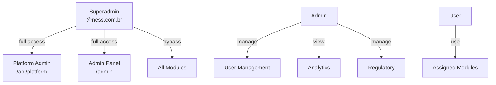
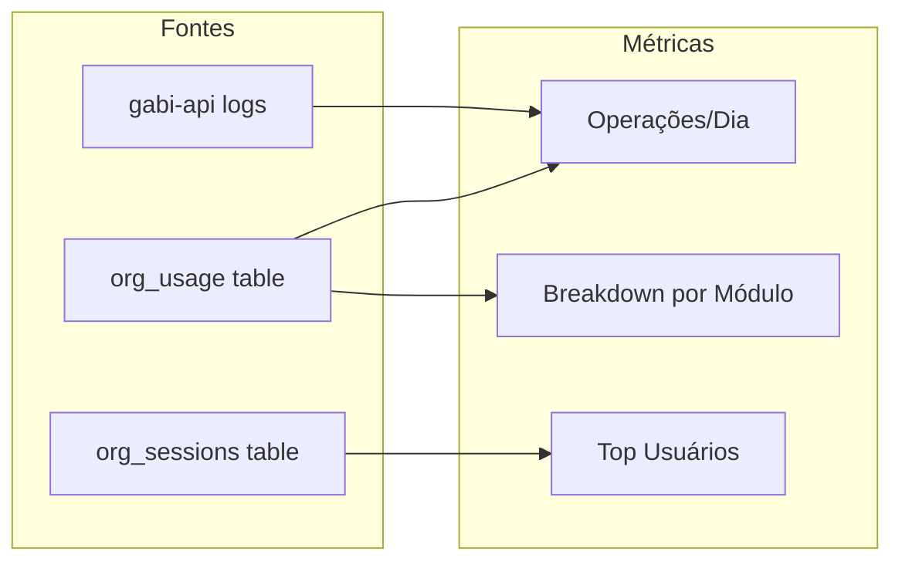
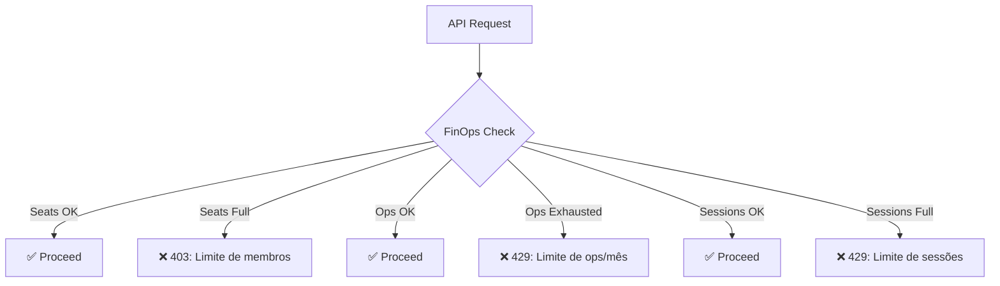

# Gabi Hub — Guia do Administrador

> Manual de administração da plataforma Gabi para admins e superadmins.

---

## Visão Geral dos Papéis



| Papel | Acesso |
|-------|--------|
| **Superadmin** | Tudo + Platform Admin + bypass de módulos |
| **Admin** | Gerenciar usuários, analytics, regulatory |
| **User** | Apenas módulos autorizados |

---

## Gestão de Usuários

### Aprovar Usuários

1. Acesse `/admin` → **Usuários**
2. Filtre por status **"Pendente"**
3. Clique em **Aprovar** para cada usuário

> 💡 Domínios configurados em `GABI_AUTO_APPROVE_DOMAINS` são aprovados automaticamente (ex: `@ness.com.br`).

### Bloquear Usuário

1. Encontre o usuário na lista
2. Clique em **Bloquear**
3. O acesso é revogado imediatamente

### Alterar Role

1. Selecione o usuário
2. Altere para `superadmin`, `admin` ou `user`
3. Salve

### Gerenciar Módulos por Usuário

1. Selecione o usuário
2. Marque/desmarque módulos: `ghost`, `law`, `ntalk`
3. Salve

> **Acesso híbrido**: O módulo deve estar habilitado tanto na **organização** (`org_modules`) quanto no **usuário** (`allowed_modules`).

---

## Platform Admin

> Acesso exclusivo para superadmins com e-mail `@ness.com.br`.

### Dashboard de Stats

**Endpoint:** `GET /api/platform/stats`

Métricas globais:
- Total de organizações ativas
- Total de usuários ativos
- Operações AI no mês corrente
- Sessões concorrentes ativas

### Listar Organizações

**Endpoint:** `GET /api/platform/orgs?limit=100&offset=0`

Lista todas as organizações com:
- Nome, plano, status, membros
- Paginação via `limit`/`offset`

### Provisionar Organização

**Endpoint:** `POST /api/platform/orgs`

```json
{
  "org_name": "Escritório Silva & Associados",
  "owner_email": "silva@escritorio.com.br",
  "plan": "starter",
  "modules": ["ghost", "law"],
  "sector": "advocacia",
  "cnpj": "12.345.678/0001-90"
}
```

### Alterar Plano

**Endpoint:** `PATCH /api/platform/orgs/{org_id}/plan`

```json
{
  "plan_name": "pro"
}
```

---

## Observabilidade

### Dashboard (`/admin/observability`)



Visualizações:
- **Gráfico de barras empilhadas**: Operações diárias por módulo (últimos 30 dias)
- **Top 5 usuários**: Mais ativos no mês
- **Breakdown por módulo**: ghost vs law vs ntalk

---

## FinOps — Limites e Metering

### Como funcionam os limites



### Tabela de limites por plano

| Limite | Trial | Starter | Pro | Enterprise |
|--------|-------|---------|-----|------------|
| `max_seats` | 3 | 10 | 50 | 0 (ilimitado) |
| `max_ops_month` | 100 | 5.000 | 50.000 | 0 (ilimitado) |
| `max_concurrent` | 2 | 10 | 50 | 0 (ilimitado) |

### Monitorar uso

- **Por org**: `GET /api/orgs/me/usage` — retorna ops por mês e sessões ativas
- **Global**: `GET /api/platform/stats` — totais da plataforma

---

## LGPD — Compliance

### Direitos do Titular

| Direito | Endpoint | Descrição |
|---------|----------|-----------|
| Acesso | `GET /api/admin/lgpd/export/{uid}` | Exporta todos os dados do usuário |
| Eliminação | `DELETE /api/admin/lgpd/erase/{uid}` | Remove dados pessoais |
| Portabilidade | `GET /api/admin/lgpd/export/{uid}?format=json` | Download em JSON |

---

## Regulatory — Base Normativa

### Pacotes Regulatórios

Frameworks suportados para seeding:
- **LGPD** — Lei Geral de Proteção de Dados
- **ISO 27001** — Gestão de Segurança da Informação
- **SOX** — Sarbanes-Oxley
- **BACEN** — Regulamentos do Banco Central

### Fluxo de Ingestão

1. `POST /api/admin/regulatory/seed` — Carrega pacote regulatório
2. Os documentos são chunkeados e embedados automaticamente
3. Ficam disponíveis para RAG no módulo Law & Comply

---

## Variáveis de Ambiente

| Variável | Descrição | Exemplo |
|----------|-----------|---------|
| `GABI_DATABASE_URL` | Connection string PostgreSQL | Secret Manager |
| `GABI_FIREBASE_PROJECT_ID` | Firebase project ID | `nghost-gabi` |
| `GABI_CORS_ORIGINS` | Origins permitidas (JSON array) | `["https://gabi.ness.com.br"]` |
| `GABI_ADMIN_EMAILS` | Superadmins automáticos | `["admin@ness.com.br"]` |
| `GABI_AUTO_APPROVE_DOMAINS` | Domínios aprovados automaticamente | `["ness.com.br"]` |
| `GABI_LOG_LEVEL` | Log level | `INFO` / `DEBUG` |
| `GABI_ENABLE_DOCS` | Habilitar Swagger UI | `true` / `false` |

---

## Troubleshooting

| Problema | Causa Provável | Solução |
|----------|---------------|---------|
| 401 em todas requests | Token Firebase expirado | Fazer login novamente |
| 403 no módulo | Módulo não habilitado | Verificar `allowed_modules` + `org_modules` |
| 429 ops limit | Limite mensal atingido | Upgrade de plano ou aguardar próximo mês |
| 429 sessions | Muitas sessões ativas | Sessions expiram após 5min de inatividade |
| Build falhando | SHORT_SHA vazio | Usar `_TAG` substitution no Cloud Build |
