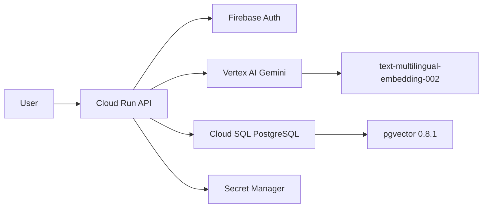

# Programa SDLC + SSDLC — Gabi Platform

## Context

A Gabi é uma plataforma AI enterprise com 2 módulos verticais (Legal + Flash), servindo setores regulados (jurídico, financeiro, seguros). O repositório tem CI/CD (Cloud Build), 199 testes (29 arquivos), monitoramento ativo, e compliance LGPD. O programa SDLC/SSDLC está **operacional** com 10 scanners de segurança automatizados no pipeline.

---

## Fase 1: Planejamento e Requisitos (PLAN)

### 1.1 Governança

| Artefato | Status | Referência |
| --- | --- | --- |
| Risk Register | ✅ | `docs/risk-register.md` |
| Threat Model (STRIDE) | ✅ | `docs/threat-model.md` — por módulo, attack surfaces, trust boundaries |
| Security Requirements | ✅ | LGPD + OWASP Top 10 + CIS Benchmarks formalizados |
| Definition of Done | ⚠️ | Implícito (tests + SAST + review), falta formalizar em doc |
| Data Classification | ✅ | `docs/data-classification.md` — PII mapping completo |

### 1.2 Requisitos de Segurança por Módulo

```text
gabi.legal  → Confidencialidade de documentos jurídicos, sigilo profissional
gabi.style  → Propriedade intelectual de textos, style profiles (Writer)
gabi.flash  → Prevent SQL injection (ALLOWED_TABLE_PAIRS), credential vault
```

### 1.3 Compliance Matrix

| Framework | Aplicável | Status |
| --- | --- | --- |
| LGPD (Lei 13.709) | ✅ | export ✅, purge ✅, consent ✅, data retention ✅ |
| OWASP API Top 10 | ✅ | rate limiting ✅, input validation ✅, SAST ✅, DAST ✅ |
| CIS GCP Benchmark | ✅ | Secret Manager ✅, Private IP ✅ |
| SOC 2 Type II | 🎯 | logging ✅, access control ✅, incident response ✅, change mgmt ⚠️ |

---

## Fase 2: Design e Arquitetura (DESIGN)

### 2.1 Secure Architecture Review

| Componente | Controle | Status |
| --- | --- | --- |
| Auth (Firebase) | Token verification + middleware | ✅ |
| Database (Cloud SQL) | Private IP, authorized networks cleaned | ✅ |
| AI (Vertex AI) | Anti-hallucination guardrail + system prompt | ✅ |
| Secrets | Secret Manager (GCP) | ✅ |
| CORS | Origin allowlist em `config.py` + `CORSMiddleware` | ✅ |
| Rate Limiting | Per-user in-memory (`core/rate_limit.py`) | ✅ |

### 2.2 Architecture Decision Records (ADRs)

| ADR | Decisão |
| --- | --- |
| ADR-001 | Vertex AI embeddings vs local → Vertex (image 2GB→400MB) |
| ADR-002 | Dynamic RAG vs always-retrieve → Dynamic (saves ~200ms) |
| ADR-003 | Multi-agent debate vs single → multi (legal accuracy) |
| ADR-004 | asyncpg vs psycopg2 → asyncpg (async throughout) |
| ADR-005 | Cloud Run vs GKE → Cloud Run (simpler ops) |

### 2.3 Data Flow



---

## Fase 3: Implementação (BUILD)

### 3.1 Coding Standards

| Area | Standard | Enforcement |
| --- | --- | --- |
| Python | PEP 8 + type hints | `ruff` linter (CI + pre-commit, config: `api/ruff.toml`) |
| SQL | Parameterized queries only | `ALLOWED_TABLE_PAIRS` allowlist |
| Secrets | Never in code | `gitleaks` (CI + pre-commit) |
| Dependencies | Pinned versions | `pyproject.toml` |
| Branching | main → staging (auto), tag → prod | Cloud Build triggers |

### 3.2 Secure Coding Practices

| Practice | Status | Detalhe |
| --- | --- | --- |
| Input validation (Pydantic) | ✅ | 20+ response models |
| Error handling (no stack traces) | ✅ | `ErrorHandler` middleware |
| Anti-hallucination | ✅ | System prompt guardrail em `multi_agent.py` |
| SQL injection prevention | ✅ | `ALLOWED_TABLE_PAIRS` + SQLAlchemy ORM only (raw SQL proibido) |
| XML safe parsing | ✅ | `defusedxml` (XXE prevention) — `xml.etree.ElementTree` proibido |
| Hash safety | ✅ | MD5 com `usedforsecurity=False` (apenas deduplicação de conteúdo) |
| Rate limiting | ✅ | `core/rate_limit.py` per-user |
| CORS config | ✅ | `config.py` origin allowlist |
| Consent tracking | ✅ | `middleware/consent.py` |

### 3.3 Pre-commit Hooks (Implementado)

```yaml
# .pre-commit-config.yaml ✅
repos:
  - repo: astral-sh/ruff-pre-commit     # ruff + ruff-format
  - repo: gitleaks/gitleaks              # secrets scan
  - repo: pre-commit/pre-commit-hooks    # check-yaml, check-json, detect-private-key
  - repo: PyCQA/bandit                   # SAST Python
```

---

## Fase 4: Testing (TEST)

### 4.1 Test Pyramid

| Nível | Atual | Ferramentas |
| --- | --- | --- |
| Unit | 29 arquivos, ~152 testes | pytest, unittest.mock |
| Integration | 6 routers cobertos, ~47 testes | pytest + TestClient |
| Load | 3 cenários k6 | k6 |
| E2E | ❌ | Futuro: playwright / httpx |

### 4.2 Security Testing Pipeline (CI — Operacional)

| # | Tipo | Ferramenta | Frequência |
| --- | --- | --- | --- |
| 1 | Tests + Coverage | `pytest --cov` | Cada push |
| 2 | SAST (Python) | `bandit` | Cada push |
| 3 | SAST (Multi-lang) | `semgrep` | Cada push |
| 4 | SCA | `pip-audit` | Cada push |
| 5 | Secrets | `gitleaks` | Cada push |
| 6 | IaC | `checkov` (Dockerfiles) | Cada push |
| 7 | Code Quality | `ruff` (700+ regras) | Cada push |
| 8 | Container (API) | `trivy` HIGH/CRITICAL | Cada build |
| 9 | Container (Web) | `trivy` HIGH/CRITICAL | Cada build |
| 10 | DAST | OWASP ZAP baseline | Cada deploy staging |

### 4.3 CI Pipeline Steps

```yaml
# cloudbuild-staging.yaml — 10 security steps (paralelos + sequenciais)
Paralelos:  test-api, sast-bandit, sca-audit, secrets-scan, iac-checkov, sast-semgrep, lint-ruff
Pós-build:  trivy-api, trivy-web, sbom-syft
Pós-deploy: dast-zap + dast-zap-report (staging only)

# cloudbuild-prod.yaml — 8 security steps (same, sem DAST)
```

---

## Fase 5: Deployment (DEPLOY)

### 5.1 Pipeline

```text
push main → gabi-staging-deploy → cloudbuild-staging.yaml → gabi-api-staging + gabi-web-staging
tag v*    → gabi-prod-deploy    → cloudbuild-prod.yaml    → gabi-api (prod) + gabi-web (prod)
```

### 5.2 Status de Deployment

| Melhoria | Status |
| --- | --- |
| Staging auto-deploy (push main) | ✅ |
| Prod tag-based deploy (tag v*) | ✅ |
| 10 security gates no pipeline | ✅ |
| Runbooks | ✅ `docs/runbooks.md` |
| SBOM generation (Syft) | ❌ Futuro |
| Image signing (cosign) | ❌ Futuro |
| Canary deployment | ❌ Futuro |

### 5.3 Environment Matrix

| Env | Trigger | Security Gates |
| --- | --- | --- |
| Dev | local | testes manuais |
| Staging | push to main | 10 scanners + DAST |
| Prod | tag v* | 8 scanners (sem DAST) |

---

## Fase 6: Operações e Monitoramento (OPERATE)

### 6.1 Observability Stack

| Pilar | Status | Ferramenta |
| --- | --- | --- |
| Metrics | ✅ | Cloud Monitoring (5xx, latency) |
| Logs | ✅ | Cloud Logging (structured JSON) |
| Uptime | ✅ | Uptime check `/health` 5min |
| Alerting | ✅ | Email notification 5xx rate |
| SLO/SLI | ✅ | `docs/slo-monitoring.md` |
| Traces | ❌ | Futuro: Cloud Trace / OpenTelemetry |
| Dashboard | ❌ | Futuro: Cloud Monitoring custom |

### 6.2 SLOs/SLIs (docs/slo-monitoring.md)

| SLI | Meta SLO | Status |
| --- | --- | --- |
| Availability | 99.9% | monitorado ✅ |
| Latency p95 | < 2s | alerta >5s ✅ |
| Error rate | < 0.1% | alerta 5xx ✅ |

### 6.3 Incident Response

| Procedimento | Status | Referência |
| --- | --- | --- |
| Runbooks | ✅ | `docs/runbooks.md` |
| Incident Response Playbook | ✅ | `docs/incident-response.md` |
| Post-mortem template | ✅ | `docs/post-mortem-template.md` |
| On-call rotation | ❌ | Equipe pequena, futuro |
| Escalation path | ❌ | Futuro |

---

## Fase 7: Maintenance e Melhoria Contínua (MAINTAIN)

### 7.1 Dependency Management

| Prática | Status | Ferramenta |
| --- | --- | --- |
| SCA no CI (vuln scan) | ✅ | pip-audit (cada push) |
| Container scan | ✅ | Trivy (cada build) |
| Automated dependency updates | ❌ | Futuro: Dependabot / Renovate |
| License compliance | ❌ | Futuro: pip-licenses |

### 7.2 Data Retention & Privacy

| Recurso | Status |
| --- | --- |
| Data retention automation | ✅ `core/data_retention.py` |
| LGPD export | ✅ `/api/admin/lgpd/export` |
| LGPD purge | ✅ `/api/admin/lgpd/purge` |
| Consent tracking | ✅ `middleware/consent.py` |
| Audit log | ✅ |
| Data classification | ✅ `docs/data-classification.md` |

### 7.3 Knowledge Base

| Artefato | Status |
| --- | --- |
| README.md | ✅ |
| Platform Overview | ✅ `docs/platform-overview.md` |
| Architecture | ✅ `docs/architecture.md` |
| Runbooks | ✅ `docs/runbooks.md` |
| Developer Guide | ✅ `docs/developer-guide.md` |
| User Guide | ✅ `docs/user-guide.md` |
| Admin Guide | ✅ `docs/admin-guide.md` |
| Risk Register | ✅ `docs/risk-register.md` |
| Threat Model | ✅ `docs/threat-model.md` |
| API docs (OpenAPI) | ⚠️ Pydantic models exist, Swagger auto-gen |

---

## Resumo de Maturidade SDLC/SSDLC

| Fase | Maturidade | Score |
| --- | --- | --- |
| PLAN (Governança) | ✅ Risk register, threat model, data classification | 4/5 |
| DESIGN (Arquitetura) | ✅ ADRs, secure review, data flow | 5/5 |
| BUILD (Implementação) | ✅ Pre-commit, coding standards, secure practices | 5/5 |
| TEST (Testing) | ✅ 10 scanners CI, 199 testes, SAST+DAST+SCA | 4/5 |
| DEPLOY (Deployment) | ✅ Staging/prod pipelines, security gates | 4/5 |
| OPERATE (Monitoramento) | ✅ SLOs, alerting, incident response | 3/5 |
| MAINTAIN (Manutenção) | ⚠️ SCA ✅, falta dependency updates automation | 3/5 |

**Score Geral: 28/35 (80%)** — Postura sólida para plataforma enterprise em setores regulados.

---

## Gaps Prioritários (Roadmap)

### P0 — Próximas Sprints

- [ ] Definition of Done formalizado
- [ ] E2E tests (playwright / httpx)
- [ ] Coverage gate no CI (80% minimum)
- [ ] Dependabot / Renovate

### P1 — Médio prazo

- [ ] OpenTelemetry traces
- [ ] Cloud Monitoring dashboard customizado
- [ ] SBOM generation (Syft)
- [ ] On-call rotation + escalation

### P2 — Longo prazo

- [ ] Image signing (cosign)
- [ ] Canary deployment
- [ ] SOC 2 Type II readiness assessment
- [ ] License compliance (pip-licenses)
