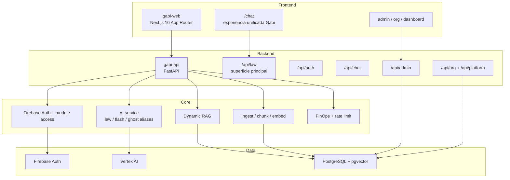

# Gabi Hub — Architecture Guide

> Runtime atual da aplicacao em producao/staging. Este documento descreve a superficie ativa do sistema, nao a historia completa do repositorio.

---

## Resumo Executivo

Gabi e um monorepo full-stack com:

- `web/`: frontend Next.js App Router
- `api/`: backend FastAPI
- `packages/core/`: tipos e utilitarios compartilhados do frontend

A superficie publica ativa do produto esta consolidada no modulo `law`, que concentra:

- agentes juridicos
- fluxos de compliance e regulatorio
- recursos de seguros
- writer/style profiles
- ingestao e consulta de base documental

Nao existe mais modulo publico `ntalk`. O legado nominal `ghost` e `flash` ainda aparece internamente como alias tecnico de roteamento de modelo e nomes de tabelas congelados.

---

## Arquitetura Atual

---

## Superficie HTTP Ativa

O backend registra atualmente estes routers:

- `/api/law`
- `/api/auth`
- `/api/chat`
- `/api/admin`
- `/api/admin/lgpd`
- rotas de organizacao e platform admin
- `/health`

`law` e o unico modulo funcional exposto como produto principal. O acesso ao modulo e controlado por `require_module("law")`.

---

## Frontend Real

O frontend usa Next.js `16.1.6` e concentra a experiencia principal em `/chat`.

Fluxos ativos relevantes:

- chat unificado com streaming
- upload inline de PDF/DOCX/TXT para analise efemera
- upload persistente de documentos para a base juridica
- gerenciamento de style profiles no painel lateral
- geracao de apresentacoes PPTX a partir de documentos
- historico de sessoes via `/api/chat`

O gating de navegacao principal hoje depende de `law`. O produto visivel para o usuario final e `Gabi`, mesmo quando partes internas ainda usam nomes legados.

---

## Backend Real

### API principal

`api/app/main.py` publica:

- `law`
- admin
- LGPD
- auth
- chat
- org
- platform

Nao ha router publico `ntalk`.

### Middleware ativo

Middlewares registrados:

- `ErrorHandlerMiddleware`
- `FinOpsMiddleware`
- `SecurityHeadersMiddleware`
- `RequestLoggingMiddleware`
- `TrustedHostMiddleware`
- `CORSMiddleware`

### Autenticacao e autorizacao

- autenticacao via Firebase ID Token
- sincronizacao/upsert de usuario no banco
- resolucao de contexto organizacional
- controle de modulo por `allowed_modules` do usuario e `org_modules`
- conjunto de modulos validos atual: `["law"]`

---

## Modulo `law`

`law` e um router unificado que agrega:

- agentes juridicos
- insurance
- insights regulatorios
- writer/style service
- upload e listagem de documentos
- extracao efemera de texto para anexos de chat
- geracao de apresentacoes

Sub-routers incluidos no mesmo namespace:

- `insurance`
- `insights`
- `style` em `/api/law/style`

---

## AI e RAG

### Model routing real

O core de IA usa aliases tecnicos internos:

- `law`: modelo de maior precisao para analise juridica
- `flash`: modelo mais barato/rapido para classificacao, RAG e sumarizacao
- `ghost`: alias legado usado para writer/criatividade

Esses nomes nao representam modulos de produto. Sao apenas rotas internas de modelo.

### Dynamic RAG

O pipeline atual faz:

- decisao se precisa ou nao de busca
- busca hibrida em PostgreSQL/pgvector
- re-ranking
- isolamento por escopo do usuario
- suporte a corpus regulatorio e documentos do usuario
- suporte a style/profile context para writer

### Ingestao

O fluxo de ingestao cobre:

- upload de documentos do usuario
- chunking
- embeddings
- persistencia em tabelas vetoriais
- extracao efemera para chat inline

---

## Modelo de Dados Atual

### Dados centrais de `law`

- `law_documents`
- `law_chunks`
- `law_alerts`
- `law_gap_analyses`

### Corpus regulatorio

- `legal_documents`
- `legal_versions`
- `legal_provisions`

### Writer/style integrado ao `law`

Esses recursos continuam com nomes de tabela legados:

- `ghost_style_profiles`
- `ghost_knowledge_docs`
- `ghost_doc_chunks`

Esse legado e intencional no runtime atual: a feature foi absorvida por `law`, mas as tabelas nao foram renomeadas.

---

## Legado Estrutural Ainda Presente

Os principais residuos tecnicos ativos sao:

- alias internos `ghost` e `flash` no roteamento de IA
- nomes de tabela `ghost_*` para style/writer
- referencias historicas em docs, testes e migrations
- nomenclatura mista entre `Gabi`, `law`, `writer` e `ghost` em alguns comentarios e artefatos auxiliares

Nada disso reabre o modulo antigo publicamente, mas esses residuos continuam importantes para manutencao, onboarding e auditoria tecnica.

---

## Estado Arquitetural Atual

O runtime atual e coerente como produto unificado. A arquitetura pratica hoje pode ser resumida assim:

- um frontend unificado
- um backend com um modulo principal exposto (`law`)
- auth e multi-tenant no core
- IA centralizada em um service comum
- writer/style absorvido pelo dominio juridico
- legado estrutural concentrado em nomes internos e naming de banco

---

## O Que Ainda Falta Para Estado Final

- eliminar ou neutralizar aliases internos de produto antigo (`ghost`)
- decidir se as tabelas `ghost_*` serao mantidas como contrato historico ou migradas
- alinhar todos os docs tecnicos e de seguranca ao runtime atual
- limpar testes, scripts e comentarios com nomenclatura obsoleta
- definir uma taxonomia final de dominio para evitar mistura entre `law`, `writer`, `style` e `gabi`

Enquanto isso nao for fechado, a aplicacao esta funcional, mas ainda em consolidacao arquitetural.
