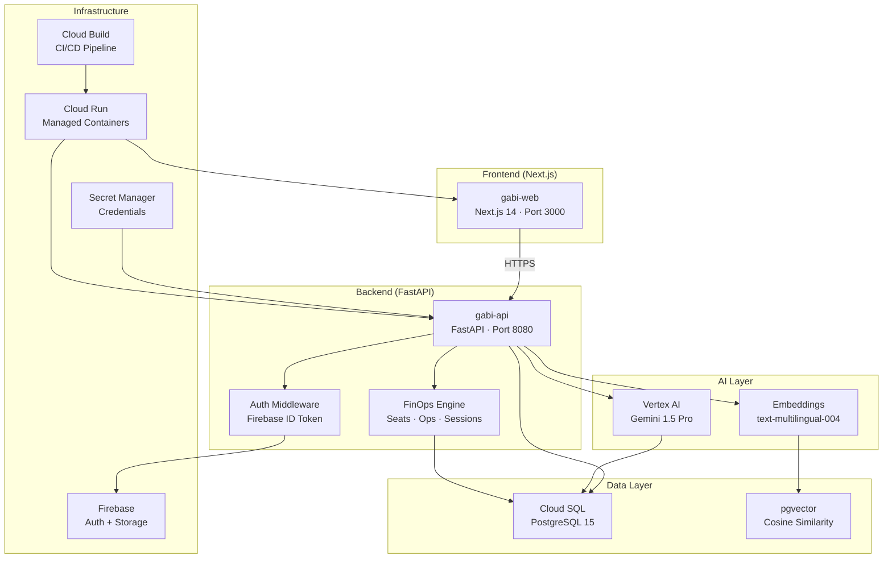
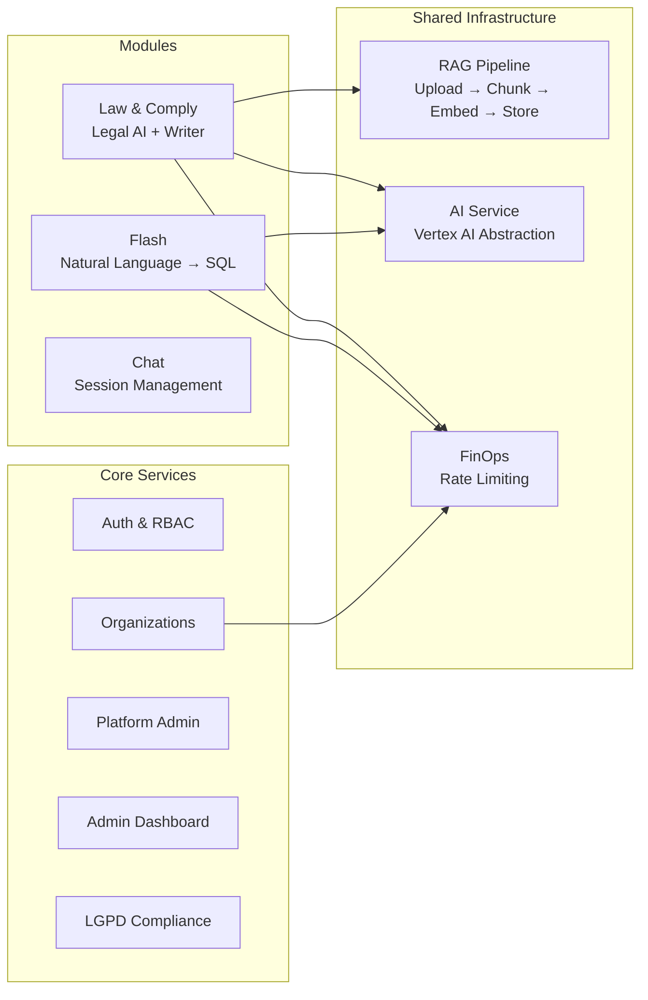
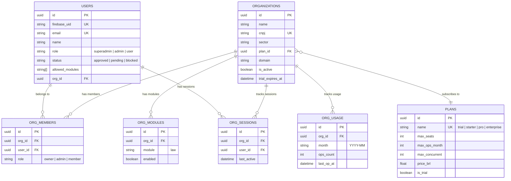
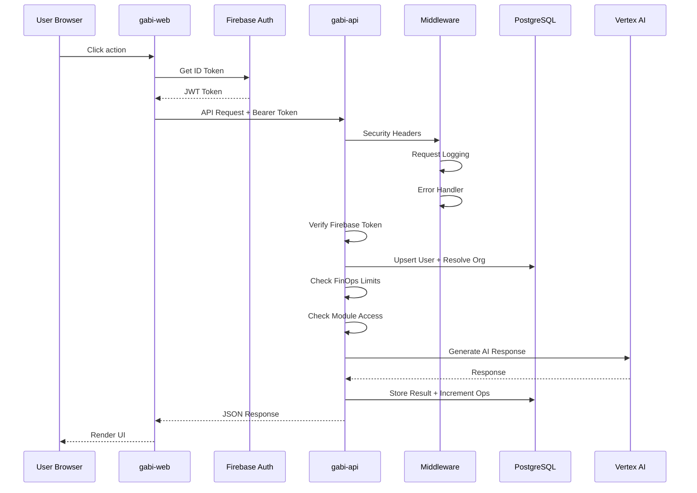
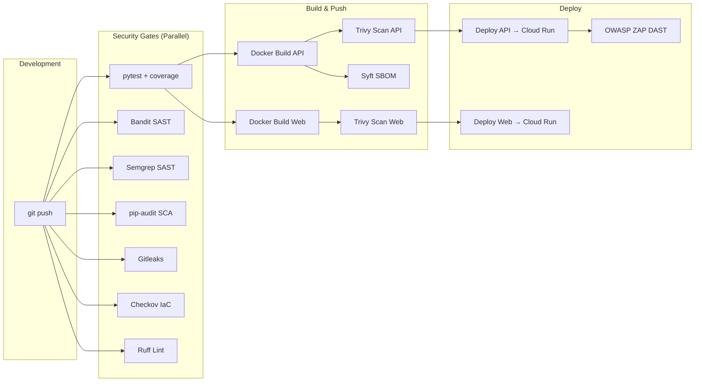

# Gabi Hub — Architecture Guide

> Enterprise-grade AI platform for legal, compliance, and business intelligence.

---

## High-Level Architecture

---

## Module Architecture

---

## Data Model (ERD)

---

## Request Flow

---

## Deployment Pipeline

---

## Security Architecture

| Layer | Control | Implementation |
|-------|---------|----------------|
| **Auth** | Firebase ID Token | JWT verification on every request |
| **RBAC** | Role-based access | superadmin → admin → user |
| **Module** | Hybrid access | org_modules (org-level) + allowed_modules (user-level) |
| **FinOps** | Rate limiting | Seats, ops/month, concurrent sessions per plan |
| **SSDLC** | Security pipeline | 18-step SSDLC: Bandit + Semgrep + Ruff + pip-audit + Gitleaks + Checkov + Trivy + ZAP DAST |
| **Headers** | Security headers | HSTS, CSP, X-Frame-Options, X-Content-Type-Options, Permissions-Policy |
| **XML** | Safe parsing | defusedxml (prevents XXE attacks) |
| **LGPD** | Data protection | Right to access, deletion, portability |
| **Secrets** | Secret Manager | DB URL, Firebase key stored in GCP Secret Manager |
| **Error** | Sanitization | Production errors never leak stack traces |

---

## Technology Stack

| Component | Technology | Version |
|-----------|-----------|---------|
| Frontend | Next.js | 14.x |
| Backend | FastAPI | 0.100+ |
| Language | Python | 3.12 |
| Database | PostgreSQL | 15 |
| Vector | pgvector | 0.7+ |
| AI | Vertex AI (Gemini) | 1.5 Pro |
| Auth | Firebase Auth | — |
| Container | Cloud Run | Gen2 |
| CI/CD | Cloud Build | — |
| Registry | Artifact Registry | — |
| Region | southamerica-east1 | São Paulo |
