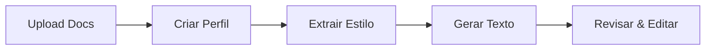

# Gabi Hub — Guia do Usuário

> Manual completo para usuários da plataforma Gabi.

---

## Primeiros Passos

### 1. Acesso à Plataforma

1. Acesse **https://gabi.ness.com.br**
2. Clique em **"Entrar com Google"**
3. Faça login com sua conta corporativa
4. Aguarde a aprovação do administrador (se for o primeiro acesso)

### 2. Status da Conta

| Status | Significado |
|--------|-------------|
| **Aprovado** | Acesso completo aos módulos autorizados |
| **Pendente** | Aguardando aprovação do administrador |
| **Bloqueado** | Acesso revogado pelo administrador |

---

## Módulos

### nGhost — Ghost Writer

Escreva textos profissionais com IA usando seu próprio estilo de escrita.

#### Como usar

1. **Upload de referências**: Envie documentos PDF/DOCX que representem seu estilo
2. **Criar perfil**: Crie um perfil de estilo com nome descritivo
3. **Extrair estilo**: Clique em "Extrair Estilo" para a IA aprender seu tom de voz
4. **Gerar texto**: Escreva seu prompt e escolha o perfil de estilo desejado

#### Fluxo de trabalho

#### Dicas
- Envie pelo menos 3 documentos para uma boa extração de estilo
- Use prompts detalhados para melhores resultados
- O modo streaming mostra a resposta em tempo real

---

### Law & Comply — Agente Jurídico

Assistente de IA para análise jurídica, compliance e gestão de sinistros.

#### Funcionalidades

| Feature | Descrição |
|---------|-----------|
| **Chat Jurídico** | Pergunte sobre legislação, jurisprudência, normas |
| **Upload de Docs** | Envie contratos, pareceres, regulamentos |
| **RAG** | A IA busca automaticamente nos seus documentos |
| **Alertas** | Prazos e vencimentos de compliance |

#### Como usar

1. Faça upload dos documentos relevantes (contratos, regulamentos)
2. Inicie uma conversa com o agente jurídico
3. Faça perguntas — a IA citará seus próprios documentos
4. Use o modo streaming para respostas longas

---

### nTalkSQL — Natural Language → SQL

Consulte seus bancos de dados usando linguagem natural.

#### Configuração

1. **Registrar conexão**: Forneça os dados de conexão do banco (host, porta, usuário)
2. **Sincronizar schema**: O sistema importa as tabelas e colunas automaticamente
3. **Dicionário**: Adicione termos de negócio para melhorar a tradução
4. **Golden Queries**: Cadastre queries aprovadas como referência

#### Como perguntar

| Pergunta | SQL gerado |
|----------|-----------|
| "Quantos clientes cadastrados este mês?" | `SELECT COUNT(*) FROM clients WHERE created_at >= '2026-03-01'` |
| "Top 5 produtos por faturamento" | `SELECT product, SUM(revenue) ... GROUP BY product ORDER BY ... LIMIT 5` |
| "Média de idade dos clientes ativos" | `SELECT AVG(age) FROM clients WHERE is_active = true` |

> ⚠️ **Segurança**: Apenas queries de leitura (SELECT) são permitidas. INSERT, UPDATE e DELETE são bloqueados.

---

## Organização

### Criar Organização

1. Acesse **Configurações** → **Organização**
2. Preencha: Nome, CNPJ (opcional), Setor
3. Escolha os módulos desejados
4. Clique em **Criar**

### Convidar Membros

1. Vá em **Organização** → **Convidar**
2. Informe o e-mail do convidado
3. Escolha o papel: **Membro**, **Admin** ou **Owner**
4. O convidado receberá um link para ingressar

### Papéis

| Papel | Permissões |
|-------|-----------|
| **Owner** | Tudo + transferir ownership + upgrade de plano |
| **Admin** | Gerenciar membros, módulos, ver billing |
| **Membro** | Usar módulos autorizados |

---

## Planos & Billing

### Planos Disponíveis

| | Trial | Starter | Pro | Enterprise |
|---|-------|---------|-----|------------|
| **Preço** | Grátis | R$ 99/mês | R$ 499/mês | Sob consulta |
| **Membros** | 3 | 10 | 50 | Ilimitado |
| **Ops/mês** | 100 | 5.000 | 50.000 | Ilimitado |
| **Sessões** | 2 | 10 | 50 | Ilimitado |
| **Trial** | 14 dias | — | — | — |

### Upgrade

1. Acesse **Billing** no menu lateral
2. Compare os planos
3. Clique em **Upgrade** no plano desejado
4. O processamento é feito pela equipe ness.

---

## Chat & Histórico

- Todas as conversas são salvas automaticamente
- Acesse o histórico pelo menu **Chat** → **Sessões**
- Exporte conversas em formato texto
- Delete sessões que não são mais necessárias

---

## Suporte

| Canal | Contato |
|-------|---------|
| **E-mail** | suporte@ness.com.br |
| **Documentação** | https://gabi.ness.com.br/docs |
| **Status** | https://status.ness.com.br |
